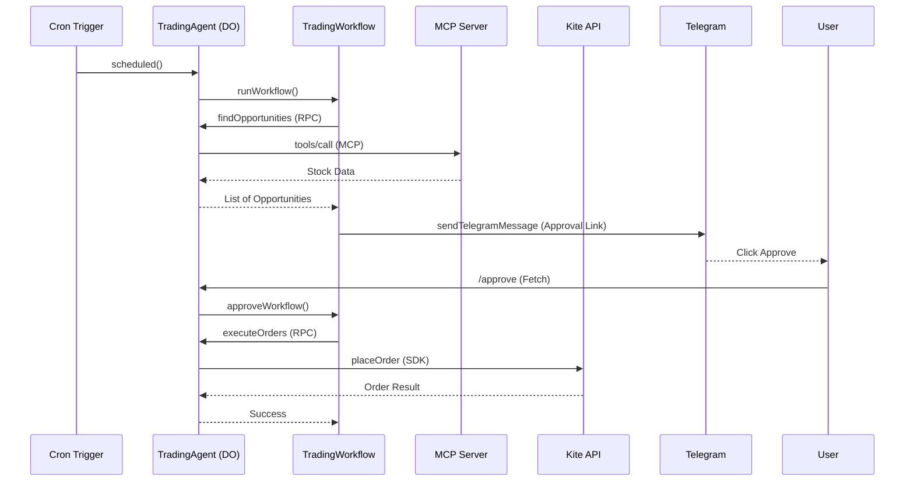

# Trading Agent Architecture

This project leverages the **Cloudflare Agents SDK** to create a durable, stateful trading bot.

## Components

### 1. TradingAgent (Durable Object)
The core "brain" of the operation. It inherits from `Agent<Env>` and provides:
- **MCP Client**: Manages a persistent connection to the technical analysis server.
- **Kite SDK**: Manages direct connection to Zerodha Kite for order placement.
- **RPC Methods**: Marked with `@callable()`, these allow Workflows to trigger market analysis and order placement.
- **Scheduling**: Uses Cron triggers to send periodic reports and trigger trades.

### 2. TradingWorkflow (AgentWorkflow)
Handles the main trading logic with human-in-the-loop:
1.  **Market Scan**: Calls the Agent to find buy opportunities (-2% dip, RSI > 50). Runs automatically on weekdays (Monday to Friday) at 3:10 PM IST (9:40 AM UTC).
2.  **Notification**: Sends a Telegram message with a link to log in if your Kite session is expired, prompting you to respond with `trade <amount>`.
3.  **Wait for Approval**: Pauses execution using `this.waitForApproval()` for up to 1 hour.
4.  **Balance & Confirmation**: When the user requests a trade, it fetches the live **available cash balance** from Zerodha Kite (or shows a mock balance if in mock mode) and asks for confirmation via `yes`/`no` replies before approval.
5.  **Execution**: If approved, calls the Agent to place orders via the Zerodha Kite SDK.

### 3. WatchlistAnalysisWorkflow (AgentWorkflow)
A reporting workflow that:
1.  Fetches technical data for a pre-defined set of ETFs. Runs automatically on weekdays (Monday to Friday) at 2:45 PM IST (9:15 AM UTC).
2.  Retrieves and parses comprehensive technical metrics: **RSI**, **ADX** (trend strength), **EMA20/50 position**, **EMA Bullish Crossover**, **MACD**, **Bollinger Bands**, and **Volume Surge**.
3.  Categorizes them into "Buy Opportunities", "Strong & Rising", or "Bearish/Weak", and explicitly lists the matching stock symbols under each category in the summary.
4.  Sends a formatted report along with a technical parameter glossary directly to your Telegram chat.

## Communication Flow

## Security & Reliability
- **Durable fiber**: Workflows ensure that even if a step fails or the worker is evicted, it resumes from the last successful checkpoint.
- **Gated Orders**: No money is spent without explicit approval from the user's Telegram interaction.
- **Session Persistence**: Kite access tokens are stored securely in the Durable Object's persistent storage.
