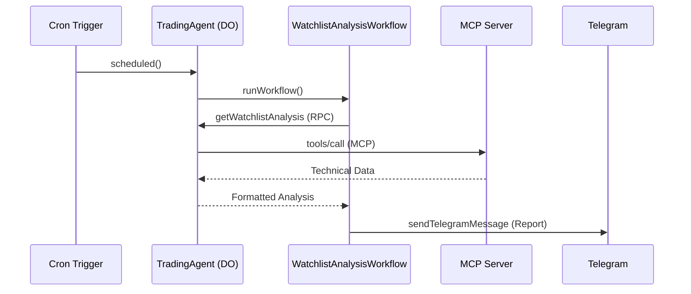

# Technical Analysis Agent Architecture

This project leverages the **Cloudflare Agents SDK** to create a durable, stateful stock analysis bot.

## Components

### 1. TradingAgent (Durable Object)
The core "brain" of the operation. It inherits from `Agent<Env>` and provides:
- **MCP Client**: Manages a persistent connection to the technical analysis server.
- **RPC Methods**: Marked with `@callable()`, these allow Workflows to trigger market analysis.
- **Scheduling**: Uses Cron triggers to send periodic reports.

### 2. WatchlistAnalysisWorkflow (AgentWorkflow)
A reporting workflow that:
1.  Fetches technical data for a pre-defined set of ETFs.
2.  Categorizes them into "Rising", "Opportunities", or "Bearish".
3.  Sends a formatted summary to the user via Telegram.

## Communication Flow

## Reliability
- **Durable fiber**: Workflows ensure that even if a step fails or the worker is evicted, it resumes from the last successful checkpoint.
