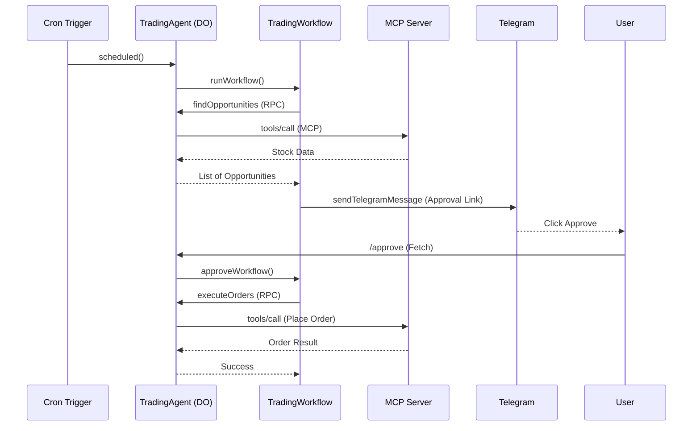

# Trading Agent Architecture

This project leverages the **Cloudflare Agents SDK** to create a durable, stateful trading bot.

## Components

### 1. TradingAgent (Durable Object)
The core "brain" of the operation. It inherits from `Agent<Env>` and provides:
- **MCP Client**: Manages a persistent connection to the technical analysis server.
- **RPC Methods**: Marked with `@callable()`, these allow Workflows to trigger analysis and order placement.
- **Scheduling**: Uses `this.scheduleEvery` or Cron triggers to maintain consistency.

### 2. TradingWorkflow (AgentWorkflow)
Handles the main trading logic with human-in-the-loop:
1.  **Market Scan**: Calls the Agent to find buy opportunities (-2% dip, RSI > 50, SuperTrend Green).
2.  **Notification**: Sends a Telegram message with an approval link.
3.  **Wait for Approval**: Uses `this.waitForApproval()` to pause execution for up to 1 hour.
4.  **Execution**: If approved, calls the Agent to place orders via the Kite API.

### 3. WatchlistAnalysisWorkflow (AgentWorkflow)
A reporting workflow that:
1.  Fetches technical data for a pre-defined set of ETFs.
2.  Categorizes them into "Rising", "Opportunities", or "Bearish".
3.  Sends a formatted summary to the user.

## Communication Flow

## Security & Reliability
- **Durable fiber**: Workflows ensure that even if a step fails or the worker is evicted, it resumes from the last successful checkpoint.
- **Gated Orders**: No money is spent without explicit approval from the user's Telegram interaction.
